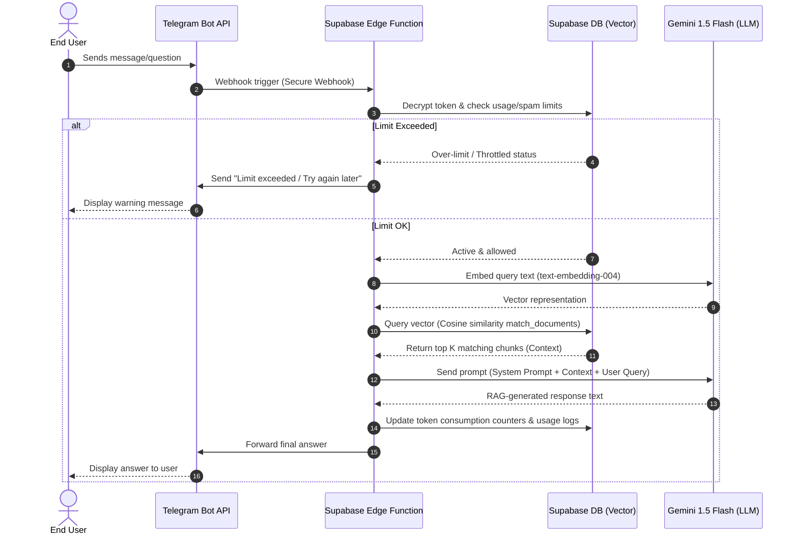

# chatbotRAG 🤖📄

`chatbotRAG` is a low-friction, cost-efficient, and easy-to-use customer service platform designed specifically for non-technical administrators (such as small business owners, university departments, and support teams) to build, configure, and launch Retrieval-Augmented Generation (RAG) Q&A chatbots on Telegram.

By combining the power of the Gemini API (via cost-efficient models like Gemini 1.5 Flash) with Supabase (serving as database, vector storage, and secure backend), chatbotRAG empowers organizations to ingest their private knowledge base and deploy an interactive chatbot in minutes using their own API keys.

---

## 🚀 Key Improvements & Enhancements
Compared to the initial conceptual brief, this specification includes several core improvements:
* **Structured Data Chunking & Processing:** Defined explicit chunk sizes, overlap parameters, and recursive splitting strategies for high-quality text retrieval.
* **Granular Plan Configurations:** Formalized strict token limits and hourly/daily query caps for the Starter and Growth subscription tiers to prevent cost overruns.
* **Hardened Security & Key Management:** Outlined database-level encryption specs using `pg_sodium` for securing client-provided Telegram bot tokens at rest.
* **Detailed DB Schema and RAG Pipeline:** Added technical blueprints for the vector storage schema, match helper functions, and runtime RAG processing.

---

## 🏗️ High-Level System Architecture

The following Mermaid diagram outlines the end-to-end user query flow and RAG pipeline:

---

## 📂 Documentation Directory Map

For a deep dive into each component's technical specifications and layout, please review the following files:

* 🛠️ **[architecture.md](file:///c:/Users/Abbas/dev/testrepo/architecture.md):** System architecture, database schema design, webhook handling, and Telegram token encryption.
* 📚 **[knowledge_base.md](file:///c:/Users/Abbas/dev/testrepo/knowledge_base.md):** Ingestion mechanics, PDF/TXT parsing rules, recursive chunking parameters, and vector generation.
* 🛡️ **[security_and_billing.md](file:///c:/Users/Abbas/dev/testrepo/security_and_billing.md):** Subscription tiers (Starter vs. Growth), request/token monitoring, rate-limiting, and spam prevention rules.
* 📊 **[dashboard_ux.md](file:///c:/Users/Abbas/dev/testrepo/dashboard_ux.md):** React dashboard layout, metrics design, plan switching flow, and non-technical admin styling guidelines.

---

## 🎯 Target MVP Roadmap (Target Date: July 20)

- [ ] **Phase 1: DB & Secure Auth Setup** - Supabase project initialization, tables, policies, and pg_sodium integration.
- [ ] **Phase 2: Data Ingestion Pipeline** - Text processing, chunking logic, and Gemini embeddings integration.
- [ ] **Phase 3: Telegram Gateway** - Webhook handler, decrypter, and basic request router.
- [ ] **Phase 4: RAG & Chat Flow** - Core context retrieval and prompt synthesis with Gemini 1.5 Flash.
- [ ] **Phase 5: Shield & Admin Portal** - Rate limits, analytics counters, and the React client dashboard interface.
