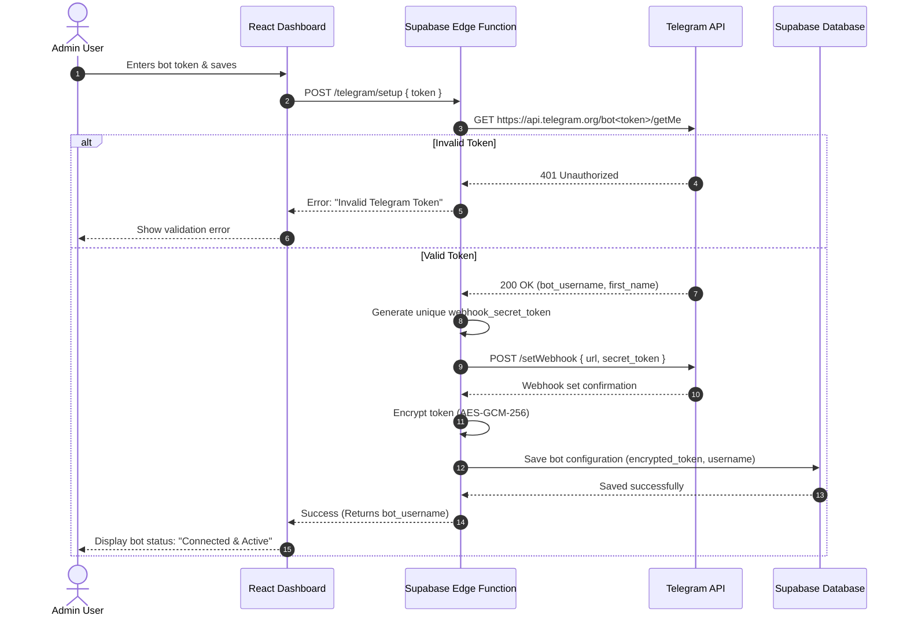

# 🛰️ Secure Telegram Bot Integration

This document outlines how the system links, registers, and handles communications with the Telegram Bot API using customer-provided credentials.

---

## 🔑 Bot Configuration & Verification Flow

When a client administrator enters a Telegram Bot Token, the platform must verify its validity and configure the webhook prior to persistence.

---

## ⚡ Webhook Payload Authentication

To prevent unauthorized parties from spoofing webhook payloads, all traffic received on the Supabase Edge Function endpoint `/functions/v1/telegram-webhook` is verified using standard Telegram webhook features:

1. **Secret Token Header:** When registering the webhook, the platform provides a cryptographically secure `webhook_secret_token` generated via `crypto.getRandomValues`.
2. **Verification Check:** Every incoming request must contain the header:
   `X-Telegram-Bot-Api-Secret-Token`
   The edge function rejects any request with a missing or mismatched token header with an HTTP `403 Forbidden` status.

---

## 🗣️ Telegram Message Router

Incoming updates from Telegram can have different types (messages, callbacks, commands). The router manages these updates as follows:

### 1. Command Processing
If the message text matches a system command:
* **`/start`**: Sends a welcoming template message. (Configurable in the client dashboard, e.g., *"Hello! How can I help you today?"*)
* **`/help`**: Returns basic operational help instructions.

### 2. Standard Text Query (RAG Input)
If the update is a plain text message:
1. Strip extra whitespaces and sanitize input.
2. Route the query to the RAG processing block (Embedding generation -> Vector search -> Gemini 1.5 Flash -> Response).
3. If Gemini times out or errors, fall back to a standard grace message: *"I apologize, but I am currently experiencing technical difficulties. Please try again in a few moments."*

---

## ⚠️ Error Handling & Fallbacks

If a request to the Telegram Bot API fails with a terminal error (such as HTTP `401 Unauthorized` or `404 Not Found`, indicating the bot token was revoked or deleted):
1. The Edge Function marks `is_active = false` for the bot in `telegram_bots`.
2. The user interface displays a warning banner to the Administrator: *"Your Telegram bot has been disconnected. Please verify your token."*
3. A notification log is pushed to the client dashboard database under "Issues".
